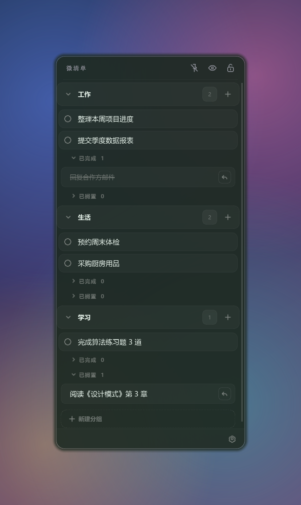
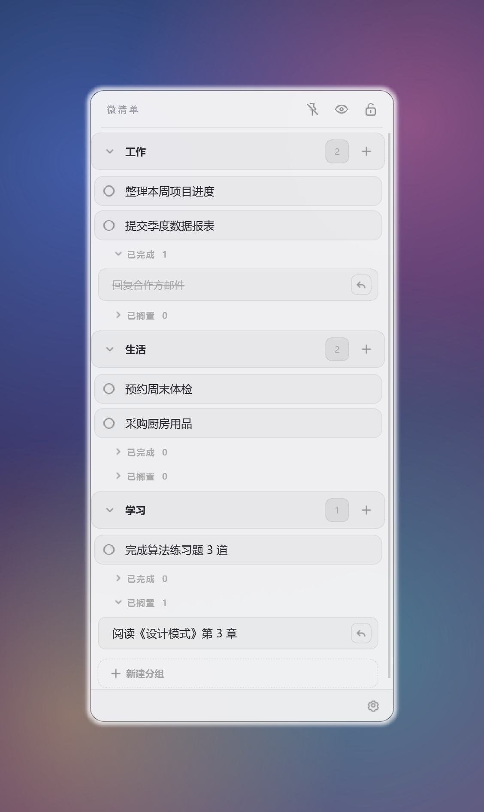
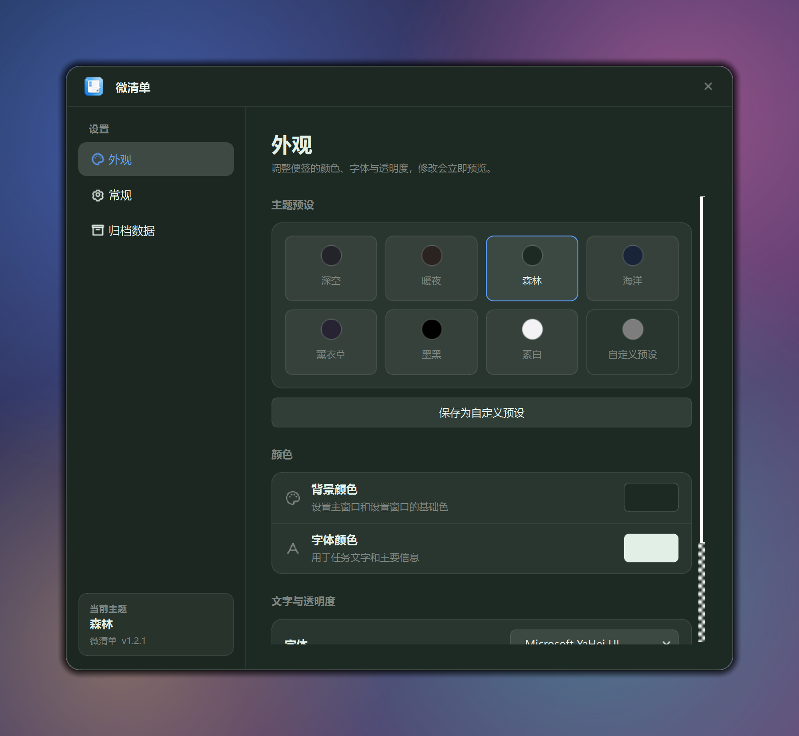
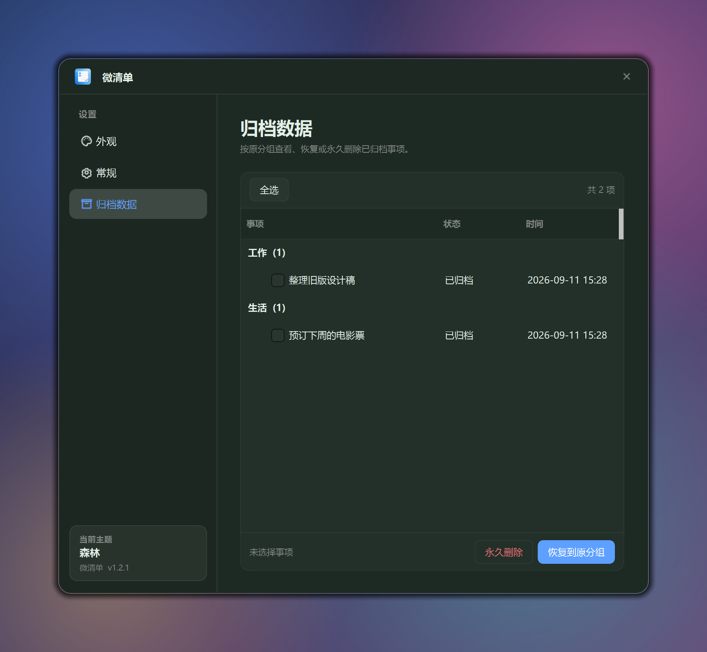
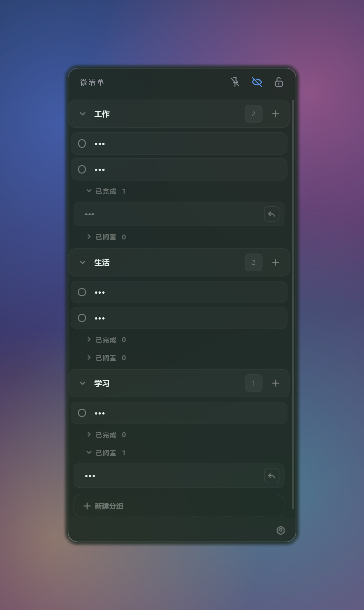

# 微清单 · Micro Todo

> 一个简洁的 Windows 桌面 TODO 软件。

[](https://www.python.org/)
[](https://doc.qt.io/qtforpython/)
[](#系统要求)
[](LICENSE)

## 功能特性

- 半透明无边框便签，可看到桌面壁纸
- 分组管理，长按拖动排序
- 点圆点即完成，双击文字直接编辑
- 已完成 / 已搁置二级列表，一键恢复
- 删除进归档，可批量恢复或永久删除
- 外观自定义：7 套预设 + 颜色/字体/字号/透明度
- 界面语言：简体中文 / English
- 锁定模式、隐私模式（隐藏任务文本）
- 空闲自动收成贴边条，托盘常驻
- 数据本地持久化，支持开机自启

## 界面预览

主界面（深色 · 森林主题）：分组、已完成、已搁置



浅色主题（素白预设）：



设置 · 外观（主题预设、颜色、字体、透明度）：



设置 · 归档数据（按原分组恢复或永久删除）：



隐私模式（隐藏任务文本）：



空闲自动收起后的贴边条 / 悬停胶囊：


## 功能说明

### 任务与分组

- 每个分组右侧的 `+` 新建任务并立即进入编辑；`Ctrl+N` 在第一个分组新增
- 双击任务文字编辑，回车保存，`Esc` 取消；清空内容即删除
- 点任务左侧圆点标记完成，完成后进入该分组的「已完成」二级列表
- 任务右键菜单：编辑 / 搁置 / 归档
- 「已完成 / 已搁置」列表可折叠，点右侧按钮把事项恢复回列表
- 长按分组标题或任务可拖动排序；分组标题右键可重命名 / 归档
- 底部「新建分组」创建新的任务分组

### 归档数据

- 任务或分组的移除是「归档」而非直接删除
- 在 设置 → 归档数据 中按原分组查看，支持跨分组多选
- 可批量「恢复到原分组」，或「永久删除」

### 外观与行为

- 设置 → 外观：7 套主题预设（深空 / 暖夜 / 森林 / 海洋 / 薰衣草 / 墨黑 / 素白）
- 可自定义背景色、字体颜色、字体、字号与背景透明度，修改即时预览
- 可将当前外观保存为自定义预设
- 设置 → 常规：切换界面语言、开机自动启动
- 标题栏图钉：窗口置顶；眼睛：隐私模式（隐藏任务文本）
- 标题栏锁头：锁定窗口，隐藏编辑控件，避免误操作
- 空闲 5 秒自动收成屏幕边缘的贴边条，鼠标移入展开「待办 N 项」胶囊
- 托盘图标常驻，可唤回窗口或退出

## 快捷键

| 快捷键 | 功能 |
| --- | --- |
| `Ctrl + N` | 新建任务 |
| `Ctrl + L` | 锁定 / 解锁窗口 |
| 双击任务 | 编辑文字 |
| 回车 / `Esc` | 保存 / 取消编辑 |
| `Esc` | 取消拖动排序 |

## 系统要求

- 操作系统：Windows 10 / 11（程序使用 Win32 原生窗口 API 实现置顶）
- Python 3.10 及以上（开发运行）

## 运行方式

```bash
# 1. 安装依赖
python -m pip install -r requirements.txt

# 2. 启动
python main.py
```

运行后通知区域会常驻托盘图标；关闭主窗口即退出程序。

## 数据存储

用户数据保存在 `%APPDATA%\Micro Todo\`，与程序目录解耦：

- `Micro Todo.db`：SQLite 数据库，保存分组与任务
- `settings.json`：外观、窗口位置、语言等设置

请勿删除该目录下的数据库文件；首次启动会自动迁移旧版 `tasks.json` 数据。

## 项目结构

```
MyToDo/
├── main.py                  # 入口：QApplication + MainWindow
├── requirements.txt
├── assets/                  # 图标资源（icon.ico 与 icons/*.svg）
├── docs/images/             # 界面预览图
└── sticky_tasks/            # 应用包
    ├── task_store.py        # 数据层：分组 / 任务 / 归档（SQLite）
    ├── main_window.py       # 主窗口（半透明、无边框、拖动、缩放）
    └── ...                  # 设置、贴边条、托盘、国际化等模块
```

## 技术栈

Python · PySide6 (Qt for Python) · SQLite · PyInstaller

## 许可证

本项目基于 [MIT License](LICENSE) 开源。
